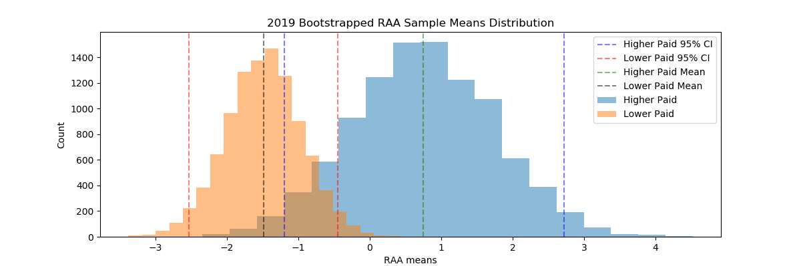
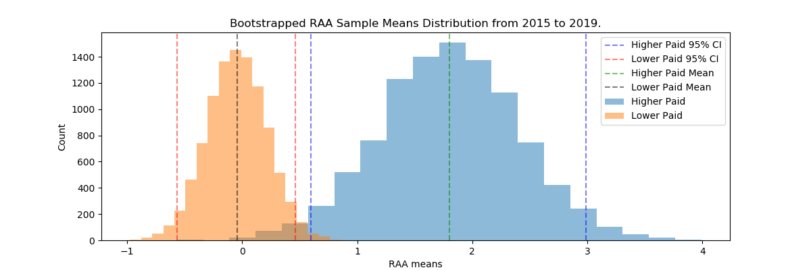
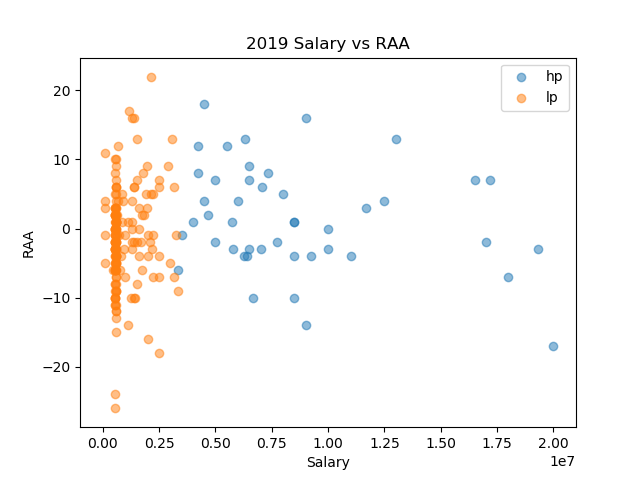

# MLB Relief Pitcher Salary vs Performance

Packaged class code for pip install
https://pypi.org/project/dfpercentile-pkg-chanrl/0.0.1/

## Glossary

* Instructions
* Background
* Objectives
* Hypothesis
* Conclusions

## Instructions

Modules Required: selenium webdriver, numpy, pandas, matplotlib.pyplot, scipy, os, glob, re  

1. On the main.py script, input the range of years you want to scrape on the **source_to_df** function. Indicate folder for the scraped csv files.
   If data is already scraped, set download argument to False.

   ```
   relievers, salaries = source_to_df(2000, 2019, directory='data', download=True)
   ```

2. Run main.py script. It should open up Chrome windows with baseball-reference on the years inputted. 
   Let the automated chrome window to fully load and close the window each time to scrape the page source properly.

3. The script should create an instance of the rp_data class called **data**.
    ```
    In [1]: run main.py
    
    In [2]: data

    Out[2]: <rp_data.rp_data at 0x7fe3db7c0f60>

    In [3]: print(data)

    The years in this data set range from 2015 to 2019.
    ```

4. Current working methods with examples below. Full docstring for each method in rp_data.py.
  - **cols = ['RA9', 'RAA', 'RAR', 'WAA', 'WAR']**
    - Current working performance metrics with the script. SV% and IS% are edge cases with own functions below.
  - **data.create_df(year, percentile, cols)**
    - Select your year of interest and percentile to separate the higher paid and lower paid pitcher groups by. 
      Ex. 2019 as the season, 80 = higher paid will be top 80th percentile for salary of the league.
    - Returns dataframe of the p-values and means of the performance metrics in cols of the higher paid(hp) and lower paid(lp) relief pitcher groups
      ```
      In [2]: data.create_df(2019, 80, cols)              
      Out[2]: 
          p-values  hp_means  lp_means
      RA9  0.017098  4.523333  5.278362
      RAA  0.020215  1.400000 -1.372881
      RAR  0.016419  6.355556  3.163842
      WAA  0.021000  0.142222 -0.125989
      WAR  0.020751  0.584444  0.262712
      ```
  - **data.create_sum_df(percentile, cols)**
    - Same as above but for the entire data set scraped
      ```
      In [4]: data.create_sum_df(80, cols)

      Out[4]: 
          p-values  hp_means  lp_means
      RA9  0.000777  4.228079  4.768947
      RAA  0.002282  1.802956 -0.044610
      RAR  0.002205  6.724138  4.633209
      WAA  0.002338  0.197044  0.007683
      WAR  0.000321  0.683744  0.416605
      ```
  - **data.bootstrap(year, percentile, performance_metric, n_sims=10000)**
    - Returns a histogram of two bootstrapped sample distributions of hp and lp, sampled from specified year and performance metric of interest, default at 10000 simulations
    - May need to use plt.show() after
      ```
      In [5]: data.bootstrap(2019, 70, 'RAA', 10000)
      ```
      
  - **data.bootstrap_stats()**
    - Returns values of upper and lower CI of sample mean distribution, sample distribution means of hp and lp groups
      ```
      In [6]: data.bootstrap_stats()

      The 95% confidence intervals for the higher paid group ranges from -1.1944029850746265 to 2.716417910447761.
      The lower paid group ranges from -2.529032258064516 and -0.44516129032258067.
      Means of the distribution - 
      Higher Paid Group: 0.7459731343283582
      Lower Paid Group:-1.4869800000000002
      ```
  - **data.bootstrap_sum(percentile, performance_metric, n_sims=10000)**
    - Same as above but samples from the entire data set scraped. Simulations also default at 10000.
    - This method separates percentile by year first and then concatenates the higher paid/lower paid groups, instead of concatenating all the dataframes first and then       separating by percentile.
      ```
      In [7]: data.bootstrap_sum(80, 'RAA', 10000)
      ```
      
  - **data.bootstrap_sum_stats()**
    - Same as bootstrap_stats above.
      ```
      In [8]: data.bootstrap_sum_stats()

      The 95% confidence intervals for the higher paid group ranges from 0.5960591133004927 to 2.9852216748768474.
      The lower paid group ranges from -0.5638475836431226 and 0.46099752168525354.
      Means of the distribution - 
      Higher Paid Group: 1.7996940886699506
      Lower Paid Group:-0.04517856257744733
      ```
  - **data.corr(year, percentile, performance_metric)**
    - Returns pearsons correlation coefficient for salary vs performance metric specified using the year specified and percentile to separate by
      ```
      In [9]: data.corr(2019, 70, 'RAA')

      For the lower paid pitcher group: 
      The correlation coefficent is 0.21077645192899985 and the p-value is 0.008474721158704807
      For the higher paid pitcher group: 
      The correlation coefficent is -0.07903372293183192 and the p-value is 0.5249457853542268
      ```
  - **data.corr_sum(percentile, performance_metric)**
    - Same as above but for the entire data set scraped
      ```
      In [10]: data.corr_sum(70, 'RA9')

      For the lower paid pitcher group: 
      The correlation coefficent is -0.05513283582386783 and the p-value is 0.14334886553850731
      For the higher paid pitcher group: 
      The correlation coefficent is 0.005439750143839066 and the p-value is 0.9247475251442581
      ```
  - **data.scatter(year, percentile, performance_metric)**
    - Returns a scatter plot of salary vs performance metric for the year specified
      ```
      data.scatter(2019, 80, 'RAA')
      ```
      
  - **data.IS(year, percentile)**
    - Returns mean of inherited runners scored % of sample year with p values of hp/lp pitcher groups separated by percentile 
      ```
      In [12]: data.IS(2017, 80)

      For the MLB season of 2017, the inherited runners scored % for the higher paid group is 0.26075
      and the lower paid group % is 0.2896815286624205 with a p-value of 0.32776612154529094.
      ```
  - **data.SV(year, percentile)**
    - Returns mean of save opportunities converted % of sample year with p values of hp/lp pitcher groups separated by percentile
      ```
      data.SV(2018, 70)
                     
      For the MLB season of 2018, the save opportunities converted % for the higher paid group is 0.47358490566037753
      and the lower paid group % is 0.3935051546391753 with a p-value of 0.20389992743623975.
      ```

5. Example usage can be viewed in example.ipynb if instructions are still unclear, or an outdated version of the script and presentation with analysis can be seen in main.ipynb.

## Background

MLB Relief pitcher salary vs performance

This capstone project pulled MLB relief pitcher salary and stats from the Baseball-Reference website in order to determine if there is a positive trend with pitcher salaries and their performance.

In the MLB season of 2019, it appears from a spectator's point of view that many highly paid relief pitchers who have signed a large contract are performing worse than expectations. 

If a GM decides to sign a relief pitcher to a large contract, you would assume that the relief pitcher would be elite or better than an average pitcher. Thus, a relief pitcher with a higher salary should have better performance versus one with a lower salary.

This project will visualize and attempt to identify trends in relief pitcher performances and their salary.

## Objectives

* Scrape web data from baseball-reference to be used in pandas
* Clean and prepare data for statistical tests and visualizations
* Run statistical tests and gather results
* Analyze results and observations, create visualizations of results

## Hypothesis

Null Hypothesis: There is no difference in performance for relief pitchers who are paid more than those that are paid less.

Alternative Hypothesis: Relief pitchers that are signed to a large contract perform differently than those with smaller contracts.

Significance level = .05

## Conclusion

On the performance metrics of RA9 (runs allowed per 9 innings), RAA (runs allowed above average), RAR (runs allowed above replacement), WAA (wins above average), and WAR (wins above replacement),
higher paid relief pitchers do perform better than lower paid relief pitchers in 2019 as well as the sum of all pitchers from 2015 - 2019. The difference has a higher significance when separating 
by the top 20th percentile versus the top 30th percentile of pitcher salaries. The difference in means is not a measure of the exact value of how much better the group of higher paid pitchers
are versus the lower paid group, but it shows that they do perform better. To quantify how much better the higher paid group versus the lower paid group and the value of salary is something else
worth investigating.

This was reinforced by bootstrapping the samples from 2019, as well as the sum of the all samples from 2019-2015. The bootstrapped sample distributions are able to show that the higher
paid group of pitchers have a better performance if observing the mean of their distribution.

An interesting point to note is that for the group of pitchers in 2019, there are some means in the distribution inside the 95% confidence interval that falls below 0 for the performance metric of RAA. 
RAA is how many runs allowed a pitcher is better than an average pitcher in the league. This shows that for this group, it is possible that if this season was played again over an x amount of simulations,
it is possible to observe this group of highly paid pitchers performing worse than the league average.

The correlation between salary and pitcher performance was also tested. The p-values for the pearson correlation coefficients found were above the .05 significance level.
The data was not able to prove that there was a correlation between relief pitcher salaries and their performances. Another interesting point is if we accept the significance level as .10,
for the pitchers in 2019 split by the top 20% of pay, the higher paid group has a negative correlation coefficient and the lower paid group has a positive correlation coefficient,
indicating the the higher paid group performed worse as their salary increased and vice versa.

Lastly, the correlation between salary and pitcher performance as a sum of the data set drew no conclusions. This is harder to observe a relationship as one would have to account for salary inflation
in the league, and a pitcher from 2015 that was in the higher bracket may be considered a lower paid pitcher in 2019, where the highest paid relief pitcher in 2015 received $10 million vs
$20 million in 2019. 
